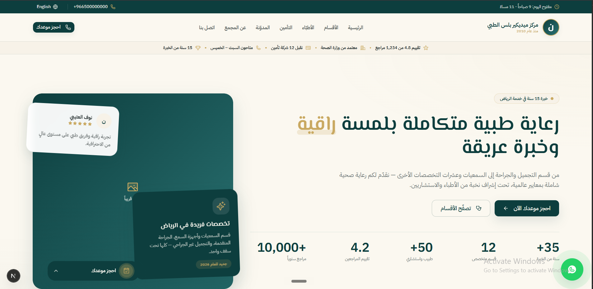
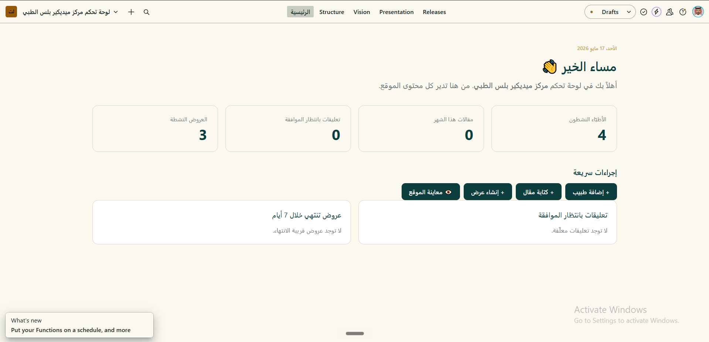
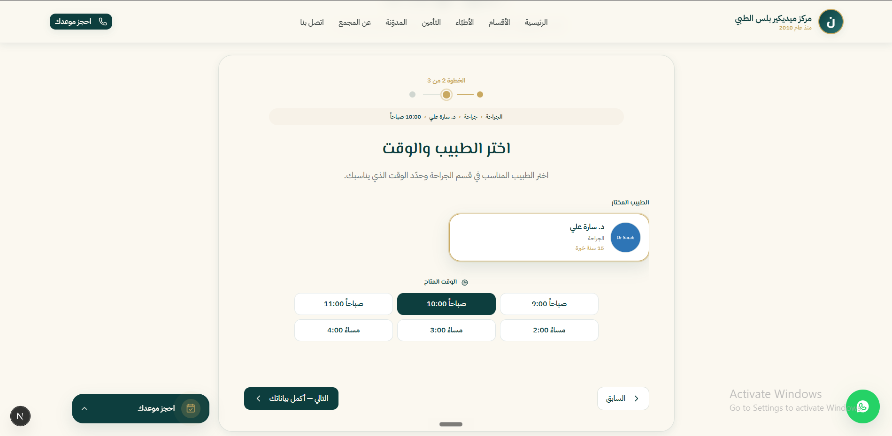
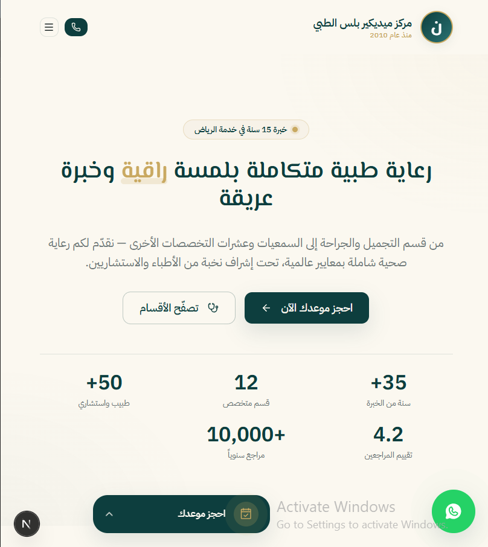
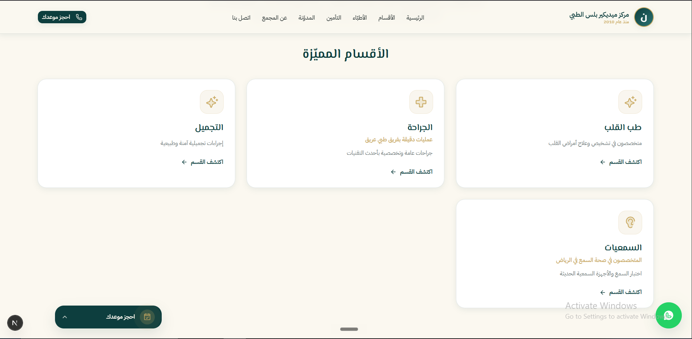
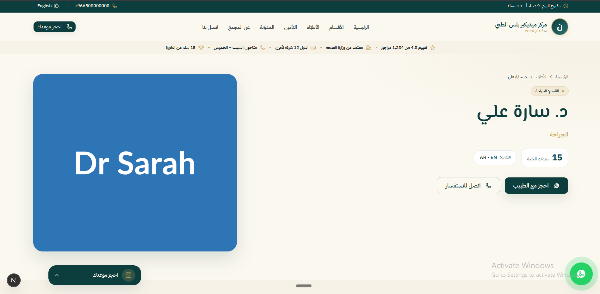

# MediCare Plus — مركز ميديكير بلس الطبي

> A bilingual website for a 15-year-old medical complex in Riyadh — built with **Next.js 16**, **Sanity CMS**, and **Tailwind 4**, with an Arabic-branded admin dashboard and a WhatsApp-first booking experience.


---

## 🌐 Live Demo

- **Website:** _(Vercel URL — to be added after deploy)_
- **CMS Dashboard:** available on request — a fully Arabic-branded admin built on Sanity Studio with role-based access.

---

## About

MediCare Plus is a 15-year-old clinic in Riyadh, Saudi Arabia, with eleven specialty departments serving thousands of families. Despite its established reputation, three departments — **Cosmetic, Surgery, and Audiology** — were underperforming, while a newer competitor founded in 2021 began capturing demand for cosmetic services in the same neighborhood.

This is a portfolio project showcasing a real-world bilingual medical website — built end-to-end as a production-ready prototype.

> **نبذة بالعربية:** موقع متكامل لمركز ميديكير بلس الطبي في الرياض، مبني بأحدث تقنيات الويب مع لوحة تحكم Sanity معرَّبة بالكامل. الموقع ثنائي اللغة (عربي/إنجليزي) مع تبديل تلقائي لاتجاه القراءة، ويعتمد على الواتساب كقناة حجز رئيسية لتجربة سريعة ومألوفة للمستخدم السعودي.

I designed this site to make those three departments visually prominent while leveraging the complex's biggest competitive asset: three decades of clinical experience. The site is bilingual (Arabic-default with English support), mobile-first (Saudi healthcare traffic skews heavily mobile), and routes every primary call-to-action through WhatsApp — which patients in the region overwhelmingly prefer over web forms.

On the operations side, I built a fully Arabic-localized Sanity Studio so non-technical staff can manage every piece of content — doctors, departments, services, offers, insurance networks, blog articles, testimonials — without ever touching code.

---

## ✨ Key Features

- 🌍 **Bilingual RTL/LTR** — Arabic-default with full English support; direction, fonts, and layouts switch automatically per locale.
- 🎛️ **Arabic-branded CMS** — Sanity Studio customized end-to-end: Arabic title, custom dashboard, logo, theme, and bespoke document actions.
- 💬 **WhatsApp-first booking** — Every CTA opens WhatsApp with a contextual, pre-filled, bilingual message (department, service, doctor, time preference, customer details).
- ⚡ **Sub-2s loads** — Static generation, AVIF/WebP images via `next/image`, Lenis smooth scroll, and a budget-conscious bundle.
- 📱 **Mobile-first** — Designed for Saudi mobile traffic patterns; every breakpoint verified in both reading directions.
- 🔄 **Real-time content updates** — On-publish webhook revalidates affected routes in seconds — no rebuild required.
- 🔐 **Role-based access** — Editor / Author / Admin roles with workflow restrictions (publish actions, testimonial approval).
- 🧱 **Structured content** — Strongly-typed Sanity schemas with localized fields, singletons, and a Presentation Tool preview pipeline.
- 🔍 **SEO + Schema.org** — Per-locale metadata, sitemap, robots, and `MedicalBusiness` / `MedicalSpecialty` / `Person` structured data.

---

## 🛠️ Tech Stack

| Layer | Choice | Why I chose it |
|---|---|---|
| Framework | **Next.js 16** (App Router) | RSC streaming, native i18n routing via `next-intl`, zero-config Vercel deploys. |
| Language | **TypeScript 5** | Strict mode, no `any` — catches whole classes of bugs at compile time. |
| Styling | **Tailwind CSS 4** | Fastest way to enforce the design system consistently across both reading directions (`rtl:`/`ltr:` modifiers). |
| Components | **shadcn/ui + Base UI** | Copy-paste primitives I own outright, plus Base UI's accessible dialog/sheet primitives. |
| CMS | **Sanity 5** (`next-sanity`, `@sanity/visual-editing`) | Chose over Strapi for real-time collaboration, a superior image pipeline (auto AVIF/WebP, hotspots), the Presentation Tool for visual editing, and the freedom to ship a fully Arabic-branded Studio. |
| i18n | **next-intl 4** | The best App Router-native i18n library — middleware, typed messages, server-side translation, language alternates. |
| Animations | **motion + GSAP + Lenis** | `motion` for declarative React animations, GSAP+ScrollTrigger for scroll-driven effects, Lenis for premium smooth-scroll feel. |
| Forms | **React Hook Form + Zod** | Performant uncontrolled inputs + schema validation I can share between client and server. |
| Carousel | **Embla Carousel** | Tiny, RTL-aware out of the box (most competing libraries silently break in Arabic). |
| Icons | **Lucide + Phosphor Duotone** | Lucide for general UI, Phosphor Duotone for feature cards (richer visual weight). |
| Animated icons | **lottie-react** | For the three featured departments — natural motion without GIF bloat. |
| Notifications | **Sonner** | Elegant toasts that match the design system. |
| Hosting | **Vercel** | One-click deploys from GitHub, edge image optimization, ISR for Sanity-driven pages. |

---

## 📁 Project Structure

```text
medicare-plus/
├── src/
│   ├── app/
│   │   ├── [locale]/                # Bilingual app routes (ar / en)
│   │   │   ├── about/               # About page
│   │   │   ├── blog/                # Blog index + [slug]
│   │   │   ├── book/                # Multi-step booking wizard
│   │   │   ├── contact/             # Contact + map
│   │   │   ├── departments/         # Departments index + [slug]
│   │   │   ├── doctors/             # Doctors index + [slug]
│   │   │   ├── insurance/           # Insurance networks
│   │   │   ├── offers/              # Active promotions
│   │   │   ├── services/[slug]/     # Individual service pages
│   │   │   └── page.tsx             # Homepage
│   │   ├── api/
│   │   │   ├── booking-options/     # Catalog feed for the booking wizard
│   │   │   ├── draft-mode/          # Enable / disable Sanity preview
│   │   │   └── revalidate/          # Sanity webhook → on-publish ISR
│   │   └── studio/                  # Embedded Sanity Studio at /studio
│   ├── components/                  # ui, layout, sections, booking, blog, etc.
│   ├── sanity/
│   │   ├── schemas/                 # 7 documents · 5 singletons · 10 objects
│   │   ├── actions/                 # Custom Studio actions (publishNow, approveTestimonial, …)
│   │   ├── components/              # Custom Dashboard + Logo
│   │   └── lib/                     # Client, queries, presentation resolver
│   ├── i18n/                        # next-intl routing + request config
│   ├── messages/                    # ar.json + en.json
│   ├── lib/                         # whatsapp.ts, seo.ts, constants.ts …
│   └── hooks/
├── content/blog/                    # Local MDX blog posts
├── docs/                            # Audit report, CMS user guide (AR), RBAC docs
├── public/
└── sanity.config.ts                 # Studio configuration
```

---

## 🚀 Getting Started

### Prerequisites
- Node.js 20+
- npm (lockfile uses npm)
- A Sanity project — create one with `npx sanity@latest init --bare`

### Install
```bash
git clone https://github.com/<your-username>/medicareplus-medical-website.git
cd medicareplus-medical-website
npm install
```

### Environment setup
```bash
cp .env.example .env.local
# Fill in NEXT_PUBLIC_SANITY_PROJECT_ID and any tokens you need
```

### Develop
```bash
npm run dev     # Next.js on http://localhost:3000
                # Sanity Studio mounted at http://localhost:3000/studio
```

### Build & lint
```bash
npm run build
npm run start
npm run lint
```

---

## 🔑 Environment Variables

See [`.env.example`](./.env.example) for the full annotated list.

| Variable | Type | Where to get it |
|---|---|---|
| `NEXT_PUBLIC_SITE_URL` | PUBLIC | Your deployment URL (e.g. `https://medicare-plus-demo.vercel.app`) |
| `NEXT_PUBLIC_SANITY_PROJECT_ID` | PUBLIC | [sanity.io/manage](https://sanity.io/manage) → project settings |
| `NEXT_PUBLIC_SANITY_DATASET` | PUBLIC | Usually `production` |
| `NEXT_PUBLIC_SANITY_API_VERSION` | PUBLIC | Optional — pins query behavior to a date |
| `SANITY_API_READ_TOKEN` | 🚫 SECRET | Sanity → API → Tokens → Viewer role (for draft preview) |
| `SANITY_WEBHOOK_SECRET` | 🚫 SECRET | Any random string; mirror it in Sanity webhook settings |
| `SANITY_DRAFT_SECRET` | 🚫 SECRET | Any random string; required to enable draft mode |

---

## ☁️ Deployment

1. Push to GitHub.
2. Import the repo into Vercel — framework preset auto-detects as **Next.js**.
3. Add the env vars above in **Project → Settings → Environment Variables**.
4. Deploy. The Studio is bundled and lives at `<your-domain>/studio`.
5. In Sanity Manage → **API → CORS origins**, add your Vercel URL with **credentials allowed** — otherwise Studio auth fails on the deployed `/studio`.
6. (Optional) Configure a Sanity webhook → `<your-domain>/api/revalidate` with `SANITY_WEBHOOK_SECRET` for sub-second content updates.
7. (Optional) Add a custom domain via **Vercel → Project → Domains**.

---

## 🧠 Challenges & Decisions

**Bilingual RTL/LTR without compromises.** Most "bilingual" sites treat the second language as an afterthought. I treated Arabic as the primary locale and used logical CSS properties (`inset-inline-start`, `ms-*`/`me-*`) throughout, plus Tailwind's `rtl:`/`ltr:` modifiers for direction-aware tweaks. Fonts swap per locale at the HTML root — El Messiri / IBM Plex Sans Arabic for Arabic, Cormorant Garamond / IBM Plex Sans for English. Every breakpoint was verified in both directions, and phone numbers always render LTR even inside Arabic paragraphs via `dir="ltr"` wrappers.

**WhatsApp as the primary booking surface.** Saudi users overwhelmingly prefer WhatsApp over web forms — long forms tank conversion. I built a typed message builder (`src/lib/whatsapp.ts`) that takes a rich context (`type: 'booking' | 'inquiry' | 'support' | 'offer' | 'doctor-inquiry' | 'general'`) plus pre-fill fields like department, service, doctor, time preference, and customer details. Each context produces a fully-formatted bilingual message with section headers and emojis, then encodes it into a `wa.me` URL. Every CTA across the site funnels through this single function, so reception receives consistently structured messages no matter where the patient started.

**A multi-step booking wizard backed by Sanity.** The `/book` route accepts query params (`?department=…&service=…&doctor=…&offer=…`) so any card on the site can deep-link into a pre-filled wizard. The catalog (departments, services, doctors, offers) is served by `/api/booking-options`, which queries Sanity for active, published content. Each step uses React Hook Form + Zod for validation, and the final submission builds the WhatsApp URL above — **no patient PII is ever stored on a server**, which simplified compliance and removed the need for backend persistence.

**Sanity schema design.** Content is split into 5 singletons (`siteSettings`, `homePage`, `topBar`, `trustBar`, `footer`), 7 documents (`department`, `doctor`, `service`, `article`, `testimonial`, `offer`, `insurance`), and 10 reusable objects (`localizedString`, `localizedText`, `localizedRichText`, `seoFields`, `faq`, `beforeAfterPair`, etc.). The localized-object pattern means editors fill `{ ar, en }` once per field and the front-end picks the active locale — no schema duplication. I added four custom document actions (`publishNowAction`, `approveTestimonialAction`, `toggleFeaturedAction`, `previewAction`) and wired up the Presentation Tool so editors can visually edit pages with live preview.

---

## 📸 Screenshots

> _Placeholder section — actual screenshots will be added to `docs/screenshots/`._

### Homepage — Hero + featured departments


### CMS Dashboard — Arabic-branded Sanity Studio


### Booking Flow — pre-filled WhatsApp wizard


### Mobile (RTL) — Arabic-first responsive layout


### Department Page — Cosmetic department detail


### Doctor Profile — booking CTA + specialties


---

## 👋 Contact

Built by Nawaf Alzanbaqi — Full-Stack Developer
   🌐 https://nawaf-alzanbaqi.dev
   💼 https://linkedin.com/in/nawaf-alzanbaqi
   ✉️ alzanbaqinawaf@gmail.com
---

_Built with care in 2026._
